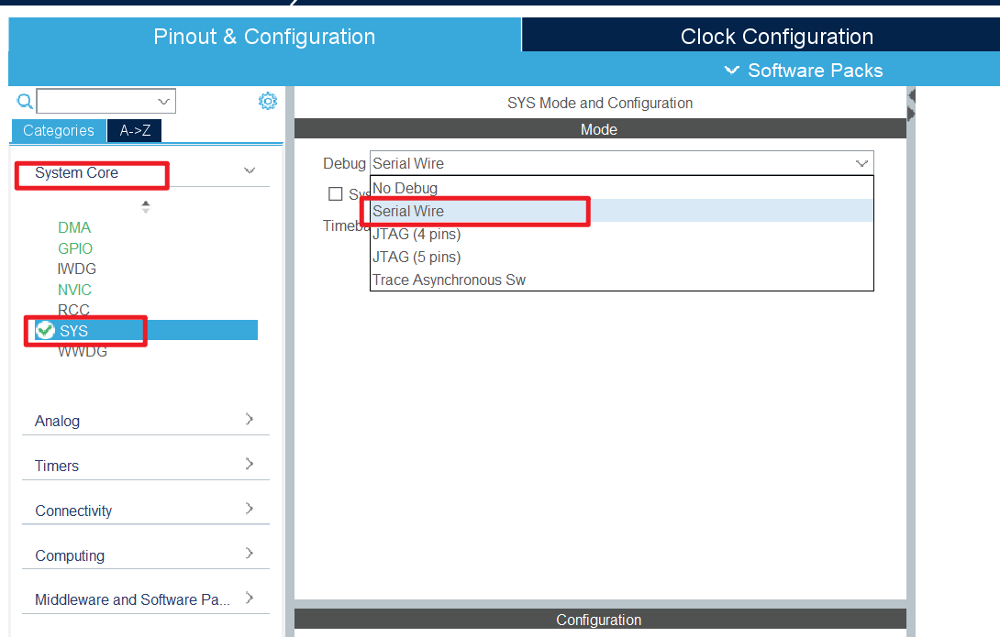

# 编译/下载失败

编译失败和下载失败的情况多种多样, 除了确实是程序写错了以外, 常见的情况还有以下几种:

## 使用了中文文件夹造成编译失败

如果小伙伴们发现编译报错与下图类似, 那么应该是你将工程创建在路径中包含中文的文件夹下了, 重新创建工程到路径中没有中文的文件夹中就好了.

## PA13 PA14 引脚被占用

许多小伙伴遇到了下载过一次程序后就无法再次下载程序的问题, 这是由于程序中 PA13 PA14 引脚(STLink 通信引脚)因为某些原因无法正常通信, 导致 STLink 无法正常与 STM32 芯片进行通信.

解决办法是首先将 Boot0 引脚拉高(例如在学习板上将 BOOT0 跳线帽改到 H 上), 然后将 STM32 重启(按复位键或重新上电), 使得单片机进入系统内存启动模式. 然后再进行程序下载.

关于 STM32 的启动模式,可以阅读[启动模式](/docs/stm32/knowledge/BootMode)进行了解.

为了日后不再出现此情况, 小伙伴们可以直接在 STM32Cube 里将调试器模式设置为 Serial Wire, 然后重新生成代码并下载. 就不会启用 JTAG 了.

下载后调试器模式为 Serial Wire 的程序后, 就可以将 Boot0 切换回低电平(学习板上将 BOOT0 跳线帽换回 L), 然后再次重启 STM32, 就又可以愉快地玩耍啦~
