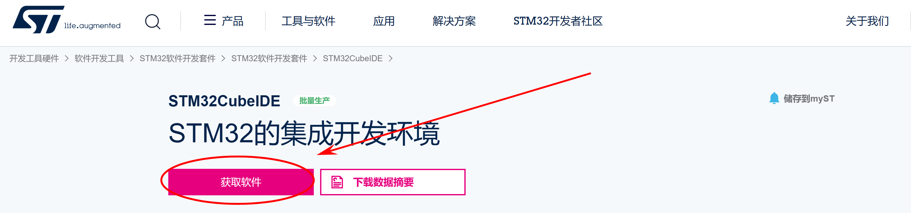
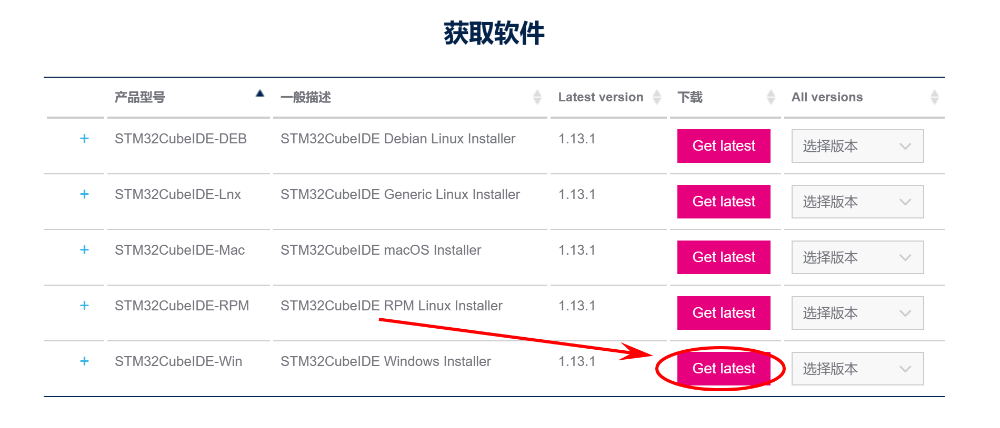
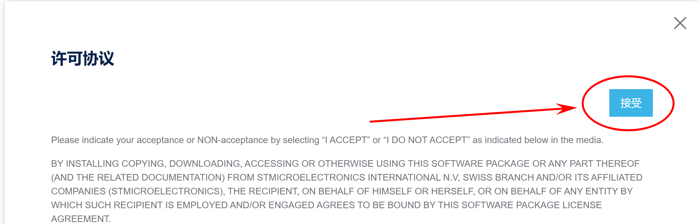

# 安装 CubeIDE 

## 安装步骤

本次图文教程将与[B站keysking视频教程](https://www.bilibili.com/video/BV1HM411b78E "好看的很!!")相结合，带领大家一步一步安装stm32官方提供的集成开发环境**cube ide**，并且解决一些在安装过程中常见的问题。

[stm32_cube_ide官方安装包下载地址](https://www.st.com/zh/development-tools/stm32cubeide.html)

或者从资料包中直接下载（搜索公众号keysking回复“资料包”获取）

首先点击上方ST公司(意法半导体)官网提供的下载地址，进入如下界面：

点击获取软件，如果进入的界面是英文界面，可以在界面右上角，进行语言设置。  
如图所示：

> 本次教程将以Windows平台为例进行教程，如果有使用Linux和Mac的同学，只需选择-Lnx和-Mac即可。安装过程大同小异。

点击Get Latest，会弹出许可协议(点击接受即可)

之后会弹出提示登陆注册或者填写姓名与邮箱进行临时下载，在这里我们推荐直接注册账号，因为新版的cube ide在安装芯片包的时候强制需要登陆My ST账号(！)，所以不如直接注册。
> 注册的过程并不复杂，如果有问题，可以在群里提出问题，请大家帮助。如果提问人数多，后续我会制作详细的图文教程

> 参考：我这里的下载速度大概是5m/s，压缩包大小大概是1G，本人总用时不到两三分钟。

下载完成后，在目录中会有en.st-stm32cubeide_…….zip的压缩包。直接解压即可，里面会有一个.exe文件  
直接双击运行后会出现窗口弹出，一直点击next/I argee/install即可。  

> 默认安装地址是C盘，大家可以根据自己需要来更改安装地址。

如下图所示：

耐心等待安装完成，最后点击finish即可

---

## 安装后操作

第一次运行ide时后弹出如图所示的窗口，是让我们选择以后工程的默认保存路径：
  

点击左下角框选后，再点击Launch开始运行。(各位也可以根据需要选择自己习惯的路径)

启动后会在默认浏览器弹出ide版本版本更新日志，关闭即可。

通过以上步骤，我们就一起完成了我们的stm32 cube ide的安装：

接下来就让我们一起进入嵌入式开发的学习之旅吧

接下来就让我们一起进入嵌入式开发的学习之旅吧

**接下来就让我们一起进入嵌入式开发的学习之旅吧！！！**

