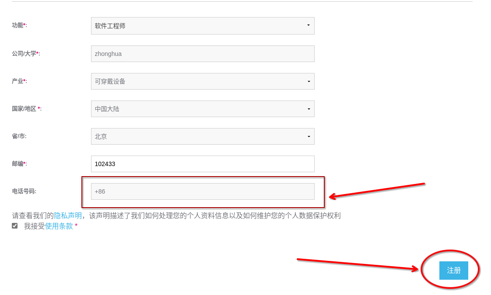

# 自行注册 ST 账号  

建议优先使用公共账号

## 注册步骤
本次注册过程**没有**使用代理工具，都是在国内网络完成注册，所以应该可以排除网络原因
1. 打开官网链接，[st.com](https://www.st.com/content/st_com/zh.html)
2. 点击**右上角**按钮，进入登录界面

3. 点击右侧的创建账户(create account)，进入注册界面

4. 前三栏根据要求任意填写即可
  
5. 接下来填写注册邮箱帐号，经验证，国内邮箱也可以使用。
  
6. 输入电话，在选择所在地区为中国大陆之后，会自动添加+86,在之后添加手机号码即可。  
7. 之后点击注册按钮。
  
8. 随后注册页面弹出如下窗口，之后登录自己的邮箱网站，在收件箱寻找**STMicroelectronics**为标题的邮件，点击后进入验证界面。  
  
9. 验证邮件打开后如图所示，请点击**Validate now**按钮。  
  
10. 之后会跳转到验证界面，根据网络状况可能跳转速度会有所差异，请耐心等待(大约在两分钟以内)。  
11. 然后会弹出如图所示的窗口，在其中输入密码，因为密码的规则较为复杂，所以注册出错的问题是由于密码格式不符合规范。
  
12.密码规则分别为
- 不要包括姓名甚至是一部分
- 至少12个字符
- 不要包括空格
- 请包括大小写字母，阿拉伯数字，特殊符号四者中至少三种
> 如果符合规则，那么规则提示栏为绿色，如图所示

  
13. 之后点击here，进行跳转，完成自己的帐号登录吧。
  
