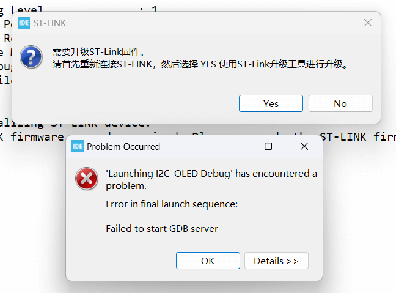
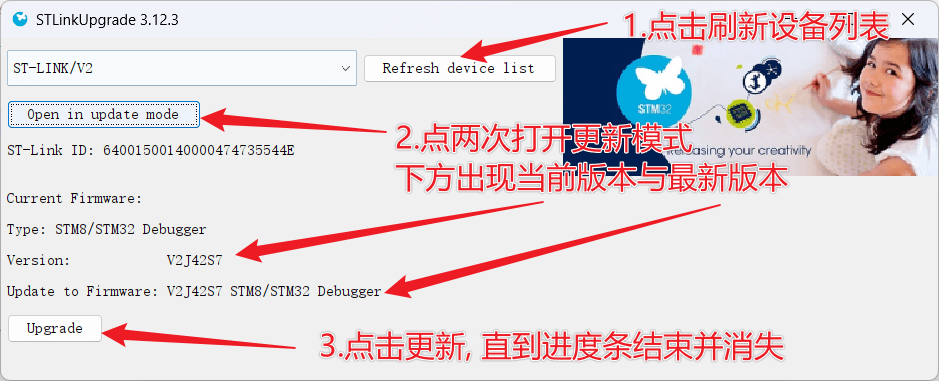
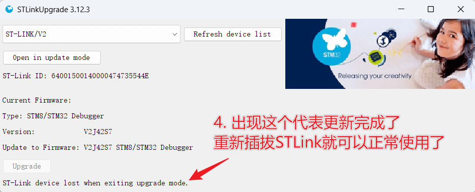

# STLink固件升级

有些小伙伴在STM32CubeIDE中进行程序下载时, 可能会下载失败, 并且弹出如下界面:

这是由于ST官方又推出了新的STLink固件, 提醒小伙伴们进行升级. 小伙伴们只需要点击升级提示的"YES", 按照接下来的操作进行设计即可:

首先, **重新插拔一次STLink与电脑的连接**, 然后点击Refresh device list, 刷新一下设备列表. 再然后点击**两次**"Open in update mode"按钮, 打开更新模式. 成功后下面的信息中会显示当前的STLink固件版本号与最新版本的STLink固件版本号.

然后就可以点击Upgrade按钮进行升级~ 

升级进度条走完后先不要着急, 等如下图所示,进度条消失并出现一行文字后, 重新STLink, 关闭此更新界面, 就可以正常使用啦😎~

## 依旧有问题?

根据小伙伴们的反馈, 有些STLink存在在Keil中可以正常使用, 但在STM32CubeIDE中无法正常使用, 也无法正常升级的问题. 如果小伙伴们按照上述操作尝试多次也无法正常升级, 可能是碰见了这种情况. 

虽未经过亲手验证, 但据多次多名小伙伴的推断, 应当是商家卖给他们的是使用垃圾芯片的STLink, 而STM32CubeIDE有一定的防盗版检测能力, 对此芯片校验不通过, 也就无法正常更新.

> 波特律动STM32学习套件中的STLink并未出现过此情况
