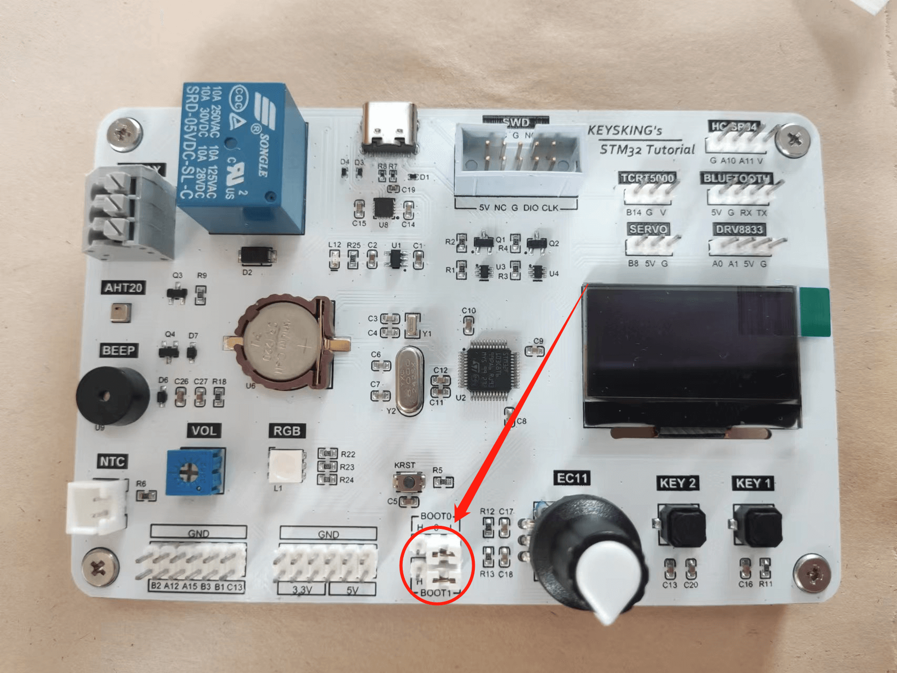

# 启动模式 Boot0与Boot1
---

 
### 在每个STM32的芯片上都有两个管脚BOOT0和BOOT1

而在开发板上的位置如图所示：

> 在默认情况下，BOOT0和BOOT1均置0，而大家也不必管他，我们只有遇到一些特殊情况时，才有考虑使用BOOT引脚的必要

该功能区域一共有三种启动引导方式可供我们选择

见下表：
- BOOT1=x   BOOT0=0   从用户闪存启动，这是正常的工作模式。一般常用的也是这个模式
> （你的BOOT引脚现在大概率就是这个状态）
- BOOT1=0   BOOT0=1   从系统存储器启动，这种模式启动的程序功能由厂家设置。 
> （其中烧录的程序在出厂时就已确定，不可修改）
- BOOT1=1   BOOT0=1   从内置SRAM启动，这种模式可以用于调试。 
> （但是断电之后，程序无法保存）

### 常见的使用场景  

1. BOOT1和BOOT0引脚均置0，MCU从user memory flash(用户闪存存储器)启动，**一般的默认情况**。

1. 当调试时出现memory locked等类似的报错信息时，很有可能是由于用户的操作不当，导致向芯片输入了不当的电压，导致了芯片的锁定，这个时候就可以通过将**BOOT1=0，BOOT0=1**，重新上电，从系统启动器启动的方式，将MCU恢复到默认状态（**最后记得将BOOT引脚还原**）

STM32单片机的Boot0和Boot1引脚是用于引导模式选择的引脚。它们与单片机的引导系统密切相关。所以无必要情况下，请不要随意拔插。

### stm32用户手册原文出处：

> from：stm32f103ve_P17