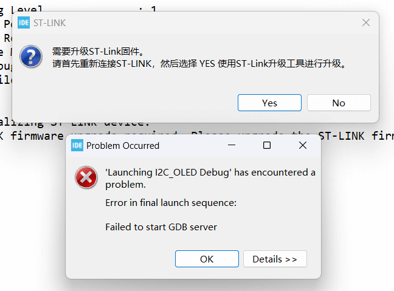

# STLink固件升级

有些小伙伴在STM32CubeIDE中进行程序下载时, 可能会下载失败, 并且弹出如下界面:

这是由于ST官方又推出了新的STLink固件, 提醒小伙伴们进行升级. 小伙伴们只需要点击升级提示的"YES", 按照接下来的操作进行设计即可:

首先, **重新插拔一次STLink与电脑的连接**, 然后点击Refresh device list, 刷新一下设备列表. 再然后点击"Open in update mode"按钮, 打开更新模式. 成功后下面的信息中会显示当前的STLink固件版本号与最新版本的STLink固件版本号.

然后就可以点击Upgrade按钮进行升级~ 

升级进度条走完后先不要着急, 等如下图所示,进度条消失并出现一行文字后, 重新STLink, 关闭此更新界面, 就可以正常使用啦😎~

